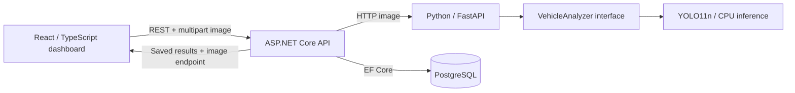

# SmartParking

A full-stack vehicle-detection dashboard. Upload a parking-lot or street image to detect visible **cars, motorcycles, buses and trucks**, inspect bounding boxes and confidence scores, and revisit saved images in analysis history.

The Python service now runs a real, pretrained **YOLO11n COCO model on CPU**. There is no simulated detector or fallback for new analyses. Model failures are reported as errors.

**Vehicle detection is not parking-space detection.** Capacity, occupied spaces, available spaces and occupancy percentage remain unknown. Detected vehicles can include moving traffic, and the model can miss or misclassify vehicles. A zero result means no detections above the threshold, not that a parking lot is empty.

## Architecture



The frontend calls only .NET. Python decodes and orients the image, filters the four supported vehicle classes, and returns confidence scores and normalized bounding boxes. The API validates the result and atomically saves the run, detection rows and uploaded image. Failed analysis creates no history entry.

Images are stored in a separate PostgreSQL table so history queries do not load image bytes. The image endpoint serves them on demand. Normalized boxes scale with the displayed image, including images with EXIF orientation.

- **Client:** React 19, TypeScript, Vite; image previews, upload validation, loading/errors, detection boxes, class counts and paginated history.
- **API:** .NET 10, controllers, DI, typed DTOs, centralized problem responses, EF Core/Npgsql, Swagger.
- **Analyzer:** Python 3.12+, FastAPI, Pillow, Ultralytics and PyTorch; one warmed model, serialized inference access, image decoding off the event loop.
- **Database:** PostgreSQL; lots, runs, detections and archived images. Previous demo-space and occupancy data is preserved for migration compatibility.
- **Infrastructure:** Docker Compose, nginx proxy and GitHub Actions CI. No automatic deployment or repository bots.

```text
client/                     Dashboard, bounding-box viewer and API client
server/SmartParking.Api/    Controllers, services, DTOs, models and migrations
server/SmartParking.Tests/  Persistence, validation and HTTP API tests
ai-service/app/             Replaceable vehicle analyzer and FastAPI routes
ai-service/scripts/         Verified model download
ai-service/tests/           Validation, adapter and real-model tests
scripts/smoke_test.py        Real inference, image and database round-trip checks
.github/workflows/ci.yml     Service builds/tests and Compose integration check
```

## Run with Docker Compose

Install Docker Engine/Desktop with Compose v2, then:

```sh
cp .env.example .env
# Edit .env and choose your own local alphanumeric POSTGRES_PASSWORD.
docker compose config --quiet
docker compose up --build -d
```

Open **http://localhost:3000**. The first build downloads Python/PyTorch dependencies and the 5.6 MB model. The analyzer image installs CPU-only PyTorch wheels and OpenCV runtime libraries. Model weights are downloaded and checksum-verified at build time; runtime inference operates offline. The health check waits for model loading and warm-up before the API starts.

| Service | Default local address |
| --- | --- |
| Dashboard | http://localhost:3000 |
| API / Swagger | http://localhost:8080/swagger |
| API database health | http://localhost:8080/health |
| Analyzer readiness / docs | http://localhost:8000/health / http://localhost:8000/docs |
| PostgreSQL | localhost:5432 |

Ports and model settings can be changed in `.env`. Refresh the dashboard if it opens before the API finishes starting.

```sh
docker compose logs -f api ai
python3 scripts/smoke_test.py --base-url http://localhost:3000
docker compose down
```

The smoke test creates two analysis runs: the reference bus image and a blank image. `docker compose down` retains the PostgreSQL volume, including saved uploads. `docker compose down -v` **deletes local database data and images**.

Compose is configured for local development with loopback ports and Swagger enabled. It is not a production deployment configuration.

## Run services locally

Prerequisites: .NET 10 SDK, Node.js 22.12+ (Node 22 recommended), Python 3.12–3.14 on a supported PyTorch platform, and PostgreSQL 17+. This feature was verified locally on macOS ARM64 with Python 3.14 and PostgreSQL 18. CI uses Python 3.12 and PostgreSQL 17.

Use an existing database and dedicated user, or prepare root `.env` and start the Compose database only:

```sh
docker compose up -d db
```

### 1. Python analyzer (terminal 1)

```sh
cd ai-service
python3 -m venv .venv
source .venv/bin/activate
python -m pip install -r requirements-dev.txt
python -m scripts.download_model --output .models/yolo11n.pt
cp .env.example .env
set -a
source .env
set +a
uvicorn app.main:app --host 127.0.0.1 --port 8000
```

Weights are ignored by Git and verified by SHA-256 during download and model loading. An already verified file is reused. There is no first-request model download; a missing or invalid model causes a clear startup failure.

On Linux CPU machines, install CPU PyTorch wheels **before** the remaining requirements to avoid downloading CUDA dependencies:

```sh
python -m pip install torch==2.13.0 torchvision==0.28.0 --index-url https://download.pytorch.org/whl/cpu
python -m pip install -r requirements-dev.txt
```

On Windows, activate with `.venv\Scripts\Activate.ps1` and set the example variables using `$env:VARIABLE='value'` rather than `source`.

| Variable | Default/example | Purpose |
| --- | --- | --- |
| `YOLO_MODEL_PATH` | `.models/yolo11n.pt` | Required path to the supported verified model |
| `YOLO_CONFIDENCE` | `0.35` | Minimum detection confidence, greater than 0 and at most 1 |
| `YOLO_IMAGE_SIZE` | `960` | Inference size; multiple of 32 between 320 and 1536 |
| `YOLO_DEVICE` | `cpu` | PyTorch inference device; CPU works without a GPU |
| `YOLO_CONFIG_DIR` | `.ultralytics` | Ignored local model settings directory |
| `YOLO_OFFLINE` | `true` | Disable upstream connectivity during inference |
| `YOLO_AUTOINSTALL` | `false` | Fail instead of auto-installing missing model dependencies |

Increase image size to experiment with smaller vehicles, or lower the confidence threshold to admit more uncertain detections. Neither guarantees accuracy. Settings require restarting Python; at most 300 detections are returned per image.

### 2. .NET API (terminal 2, repository root)

Replace the database values with your local configuration:

```sh
export ConnectionStrings__ParkingDb='Host=localhost;Port=5432;Database=smartparking;Username=smartparking;Password=YOUR_LOCAL_PASSWORD'
export AiService__BaseUrl='http://localhost:8000/'
export ASPNETCORE_URLS='http://localhost:8080'
export ASPNETCORE_ENVIRONMENT='Development'
export Database__ApplyMigrations='true'
dotnet run --project server/SmartParking.Api --no-launch-profile
```

The API applies committed migrations only when opted in. The new migration adds vehicle detections and image storage while labeling existing runs `legacy-demo`. It does not delete previous results. Old demo counts are not shown as real measurements and their images are unavailable because the earlier version did not archive uploads.

### 3. React dashboard (terminal 3)

```sh
cd client
cp .env.example .env
npm ci
npm run dev
```

Open the address printed by Vite, normally http://localhost:5173. Set `API_PROXY_TARGET` in `client/.env` to the running .NET address and restart Vite if it differs from the example. Both development and preview modes forward `/api`; Docker uses nginx. `VITE_API_BASE_URL` is a build-time option for a separately hosted API; configure `Cors__Origins__0` to the exact frontend origin if using it.

Upload a JPEG or PNG, then inspect the vehicle boxes and class counts. You can hide/show boxes, select a result to see its confidence, and use **View image** in history to inspect earlier snapshots. **Back to latest** restores the latest snapshot and its count.

## API

Demo lot ID: `11111111-1111-1111-1111-111111111111`. The seeded 24 spaces are configuration retained from the first MVP; they are not measurements of uploaded images.

| Method | Path | Purpose |
| --- | --- | --- |
| GET | `/api/parking-lots` | Configured lots |
| GET | `/api/parking-lots/{id}` | One lot |
| GET | `/api/parking-lots/{id}/analyses?page=1&pageSize=20` | Newest-first history; page size 1–100 |
| POST | `/api/parking-lots/{id}/analyses` | Multipart field `image`; returns 201 and Location |
| GET | `/api/parking-lots/{id}/analyses/{analysisId}` | Persisted detection snapshot |
| GET | `/api/parking-lots/{id}/analyses/{analysisId}/image` | Archived JPEG/PNG bytes; 404 for legacy runs |
| GET | `/health` | Database connectivity readiness |

```sh
curl -F 'image=@parking-lot.jpg' \
  http://localhost:8080/api/parking-lots/11111111-1111-1111-1111-111111111111/analyses
```

A new snapshot includes identifiers, UTC `createdAt`, filename, `analyzer: "yolo11n-coco-v1"`, `mode: "vehicle-detection"`, `vehicleCount`, image dimensions, relative `imageUrl`, and detections. A detection contains `vehicleId`, `className`, `confidence` and `box: { x, y, width, height }`, normalized to the oriented image in the 0–1 range. Parking statistics are explicitly `null`. History wraps snapshots in `{ items, total, page, pageSize }`. Timestamps display in the viewer's timezone and use PostgreSQL-compatible microsecond precision.

The internal Python endpoint is `POST /analyze`, multipart field `image`; configured space IDs are no longer sent. It returns image dimensions, analyzer identity and detections. Existing .NET/Python/frontend containers should be rebuilt together because this replaces the demo response contract.

Uploads accept non-empty JPEG/PNG images up to 5 MiB and 16 megapixels. Actual decoding follows MIME validation. Errors: 400 invalid upload, 404 unknown resource/image, 502 invalid/unavailable analyzer, 504 analyzer timeout. Python readiness is 503 until the model is loaded and warmed. The API waits at most 30 seconds for inference.

## Database

- `ParkingLots` and `ParkingSpaces`: existing configuration; space configuration is not detected capacity.
- `AnalysisRuns`: lot, UTC timestamp, filename, analyzer, mode and oriented image dimensions; indexed for history.
- `VehicleDetections`: run/vehicle composite key, class, confidence and normalized geometry.
- `AnalysisImages`: one uploaded image and MIME type per real run, stored separately from history metadata.
- `OccupancyResults`: preserved legacy demo data; new vehicle-only analyses do not create occupancy rows.

All related rows are saved in one transaction. Historical images are retained until their analysis/database data is removed. Object storage and retention controls are possible future improvements if archive volume grows.

## Tests and CI

```sh
npm run build --prefix client
npm test --prefix client
dotnet restore server/SmartParking.Tests/SmartParking.Tests.csproj --locked-mode
dotnet build server/SmartParking.Tests/SmartParking.Tests.csproj --no-restore --configuration Release
dotnet test server/SmartParking.Tests/SmartParking.Tests.csproj --no-build --configuration Release
```

With the Python environment activated and model variables exported, from `ai-service`:

```sh
python -m pytest
```

The real-model test is skipped only when `YOLO_MODEL_PATH` is unset. CI explicitly downloads the verified model and sets the variable, so real inference is tested there. Test doubles isolate endpoint and geometry failures; they are never runtime fallback analyzers.

Local verification: React build and **15 tests**, .NET Release build and **30 tests**, Python **12 tests including real inference**, Swagger generation, and the full frontend-proxy → .NET → YOLO → PostgreSQL smoke test passed. That test validates a detected bus, a blank-image zero, unknown parking statistics, exact saved JSON/image round trips, historical results and invalid-upload rejection without persistence.

CI runs on pull requests targeting `main` and pushes to `main`, with service builds/tests plus a disposable four-service Compose integration check. Docker is not installed in this implementation environment, so the new Docker build still requires execution in CI or on a Docker-enabled machine. Browser automation is unavailable locally; responsive layout and overlay appearance still need visual review. Component tests cover normalized box placement, visibility, image errors, history selection and keeping capacity unknown.

## Model and fixture sources

- Model: [Ultralytics YOLO11 documentation](https://docs.ultralytics.com/models/yolo11), official `yolo11n.pt` COCO weights.
- Model/runtime licensing: [Ultralytics upstream license](https://github.com/ultralytics/ultralytics/blob/main/LICENSE).
- Test image: official Ultralytics `bus.jpg`; source and license links are included alongside the fixture.

No model weights, settings, `.env` files, dependency caches, build output or IDE files should be committed. Feature work stays on `feature/vehicle-detection` until reviewed. No PR or merge is created automatically.

## Next iteration

Parking-space detection is the next separate task: identify empty and occupied space boundaries, match vehicles to spaces, and evaluate against labeled parking-lot images before reporting capacity or availability. Other future work includes aerial/small-vehicle tuning, camera calibration, authentication, multiple-lot management, image-retention controls and production deployment.
