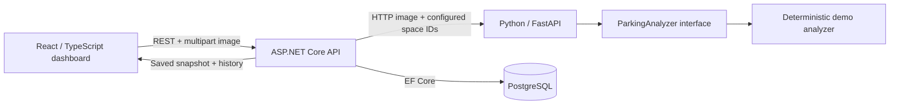

# SmartParking

A working parking occupancy dashboard with image uploads, persisted analysis history, and a separate image-analysis service. This portfolio MVP implements the complete application flow; the detector is deliberately simulated so real computer vision can be introduced independently.

**Current detector: deterministic demo, not vehicle detection.** It decodes an image and hashes its pixels to assign occupancy to configured spaces. The same pixels and space IDs produce the same result. Confidence is fixed at 0.5 and is not a model probability. The UI labels this explicitly.

## Architecture



The browser only calls the application API. Python has no database access. The .NET service validates the analyzer's result, then saves the run and all occupancy rows in one EF Core transaction. Failed analysis does not create history entries. Uploaded images are processed in memory and are **not retained**; only their sanitized filenames and occupancy results are stored.

- **Client:** React 19, TypeScript, Vite; responsive dashboard, preview/drop upload, loading/error states, schematic occupancy map, paginated history.
- **API:** .NET 10, ASP.NET Core controllers, DI services, typed DTOs, centralized problem responses, EF Core, Npgsql, Swagger.
- **Analyzer:** Python 3.12+, FastAPI, Pillow, isolated `ParkingAnalyzer` protocol; image decoding runs off the event loop.
- **Data:** PostgreSQL; migration seeds one lot with 24 spaces (A01–A12 and B01–B12).
- **Infrastructure:** Docker Compose, nginx same-origin proxy, GitHub Actions CI.

```text
client/                     React application and nginx configuration
server/SmartParking.Api/    Controllers, services, DTOs, EF models and migrations
server/SmartParking.Tests/  Service, HTTP API and upstream-client tests
ai-service/app/             FastAPI endpoint and replaceable analyzer
ai-service/tests/           Image validation and analyzer tests
scripts/smoke_test.py        Real HTTP upload and persistence verification
.github/workflows/ci.yml     Builds, tests and disposable Compose integration check
```

## Run with Docker Compose

Prerequisite: Docker Engine/Desktop with Compose v2.

```sh
cp .env.example .env
# Edit .env: replace POSTGRES_PASSWORD with your own local alphanumeric password.
docker compose config --quiet
docker compose up --build -d
```

Default local addresses (host ports can be changed in `.env`):

| Service | Address |
| --- | --- |
| Dashboard | http://localhost:3000 |
| API / Swagger | http://localhost:8080/swagger |
| API database health | http://localhost:8080/health |
| Analyzer docs | http://localhost:8000/docs |
| PostgreSQL | localhost:5432 |

Open the dashboard and upload a JPEG or PNG. The API applies the committed initial migration on startup when `Database__ApplyMigrations=true`. PostgreSQL and Python readiness checks gate API startup. If the dashboard initially reports a connection error while the API starts, use Refresh.

```sh
docker compose logs -f api ai
python3 scripts/smoke_test.py --base-url http://localhost:3000
docker compose down
```

The smoke test adds two demo analyses to the selected development database. `docker compose down` preserves the named PostgreSQL volume. `docker compose down -v` removes it and **deletes local database data**.

Compose is a local development configuration: ports bind to loopback and Swagger is enabled. It is not a production deployment configuration.

## Run services locally

Prerequisites: .NET 10 SDK, Node.js 22.12+ (Node 22 recommended), Python 3.12–3.14, PostgreSQL 17+.

You can use an existing PostgreSQL instance with a dedicated database/user, or start only the Compose database after preparing `.env`:

```sh
docker compose up -d db
```

### 1. Analyzer (terminal 1)

```sh
cd ai-service
python3 -m venv .venv
source .venv/bin/activate
python -m pip install -r requirements-dev.txt
uvicorn app.main:app --host 127.0.0.1 --port 8000
```

On Windows, activate with `.venv\Scripts\Activate.ps1` instead of `source`.

### 2. API (terminal 2, repository root)

Replace the database values below to match your local PostgreSQL configuration. Do not commit credentials.

```sh
export ConnectionStrings__ParkingDb='Host=localhost;Port=5432;Database=smartparking;Username=smartparking;Password=YOUR_LOCAL_PASSWORD'
export AiService__BaseUrl='http://localhost:8000/'
export ASPNETCORE_URLS='http://localhost:8080'
export ASPNETCORE_ENVIRONMENT='Development'
export Database__ApplyMigrations='true'
dotnet run --project server/SmartParking.Api --no-launch-profile
```

In PowerShell use `$env:VARIABLE='value'` for each environment setting. Database migrations are opt-in so production migration ownership can be separated later. The design-time EF factory reads `ConnectionStrings__ParkingDb` for future migration commands.

### 3. Dashboard (terminal 3)

```sh
cd client
cp .env.example .env
npm ci
npm run dev
```

Open the URL printed by Vite (normally http://localhost:5173). If the client reports that the API connection is not configured, create `client/.env` from the example, set `API_PROXY_TARGET` to the address printed by the running .NET server, and restart Vite. Both `npm run dev` and `npm run preview` forward API requests using this setting. `API_PROXY_TARGET` forwards `/api` to the .NET API during development. Docker uses nginx for the same route. `VITE_API_BASE_URL` can be set at build time for a separately hosted API; configure `Cors__Origins__0` on the API to the exact frontend origin in that case. No service URLs or credentials are embedded in application code.

## API

Demo lot ID: `11111111-1111-1111-1111-111111111111`.

| Method | Path | Purpose |
| --- | --- | --- |
| GET | `/api/parking-lots` | Configured lots and spaces |
| GET | `/api/parking-lots/{id}` | One lot |
| GET | `/api/parking-lots/{id}/analyses?page=1&pageSize=20` | Newest-first history; page size 1–100 |
| POST | `/api/parking-lots/{id}/analyses` | Analyze multipart field `image`; returns 201 and Location |
| GET | `/api/parking-lots/{id}/analyses/{analysisId}` | Read the persisted snapshot |
| GET | `/health` | Database connectivity readiness check |

A snapshot includes IDs, UTC timestamp, filename, analyzer version, total/occupied/available counts, occupancy percentage and each space's label, occupied flag and confidence. History wraps snapshots in `{ items, total, page, pageSize }`. The frontend displays timestamps in the viewer's local timezone.

```sh
curl -F 'image=@parking-lot.jpg' \
  http://localhost:8080/api/parking-lots/11111111-1111-1111-1111-111111111111/analyses
```

The internal Python endpoint is `POST /analyze`, with multipart fields `image` and comma-separated `space_ids`. It returns `{ analyzer, spaces: [{ spaceId, occupied, confidence }] }`.

Uploads accept non-empty JPEG/PNG images up to 5 MiB and 16 megapixels. MIME checks are followed by actual decoding; invalid bytes and oversized images are rejected. Unknown resources return 404, invalid input returns 400, unavailable or inconsistent analyzer responses return 502, and analyzer timeout returns 504. The API waits at most 30 seconds for Python. Python is a dedicated internal service; the dashboard never calls it directly.

## Database

- `ParkingLots`: lot identity and name.
- `ParkingSpaces`: identity, lot foreign key and unique per-lot label.
- `AnalysisRuns`: lot foreign key, UTC timestamp, sanitized image name and analyzer version. Indexed by lot and timestamp for history.
- `OccupancyResults`: run/space composite primary key, occupied flag and confidence; foreign keys keep results attached to configured spaces.

Each successful analysis adds a new snapshot; previous results are preserved. Counts are derived from stored occupancy rows rather than duplicated aggregate columns. This supports historical analytics in a later iteration.

## Verification and CI

From the repository root:

```sh
npm ci --prefix client
npm run build --prefix client
npm test --prefix client
dotnet restore server/SmartParking.Tests/SmartParking.Tests.csproj
dotnet build server/SmartParking.Tests/SmartParking.Tests.csproj --no-restore --configuration Release
dotnet test server/SmartParking.Tests/SmartParking.Tests.csproj --no-build --configuration Release
ai-service/.venv/bin/python -m pytest ai-service
python3 scripts/smoke_test.py --base-url http://localhost:3000
```

Use the active virtual environment's `python -m pytest` equivalent on Windows.

Client tests cover input validation, history rendering, error/retry handling and multipart upload with snapshot updates. Backend tests cover persistence, totals, invalid/oversized images, missing resources, upstream failures/inconsistent results, HTTP problem responses and Swagger generation. Backend tests use relational SQLite in memory; the smoke test verifies the actual PostgreSQL and Python integration, including deterministic results, the created-resource round trip and rejection without persistence.

CI runs for **pull requests targeting `main` and pushes to `main`**. It installs/builds/tests each service, then builds and runs all four services with Compose and executes the smoke test. Integration services and volumes are disposable. There are no deployment, automatic PR, automatic merge, release or dependency-bot workflows.

Local verification during implementation: React build and 6 tests, .NET build and 16 tests, Python 7 tests, and the real frontend-proxy → .NET → Python → PostgreSQL smoke test passed. PostgreSQL 18 was run temporarily for that test. Docker/Compose is not installed in the implementation environment, so container builds and the PostgreSQL 17 Compose stack still need execution in CI or on a Docker-enabled machine. Browser automation was unavailable; browser visual/manual QA remains outstanding.

## Git workflow

The initial MVP is on `feature/mvp-foundation`, with commits grouped by API/database, analyzer, dashboard, infrastructure, CI and documentation. Keep `main` stable; review the feature branch before merging. No pull request is created automatically. Later meaningful changes can use `feature/image-analysis`, `feature/ai-service`, or similar branches. Never commit `.env`, build output, virtual environments, IDE files or credentials.

## Limits and next iteration

- The detector is simulated; occupancy must not be used for real parking decisions. The map is a schematic, not an overlay or measured parking-space geometry.
- One seeded demo lot; the API/schema identify lots independently, but lot administration and selection are future work.
- No authentication, rate limiting, camera feeds, realtime updates, notifications or production deployment.
- Images are not archived. History stores occupancy and filenames, not a historical image preview.
- The next vision iteration needs configured parking-space polygons and camera calibration, then a YOLO/OpenCV implementation behind `ParkingAnalyzer` plus an evaluation dataset and meaningful confidence scoring.
- Authentication, multi-lot management, historical aggregation and cloud deployment can follow once the basic detector is validated.
